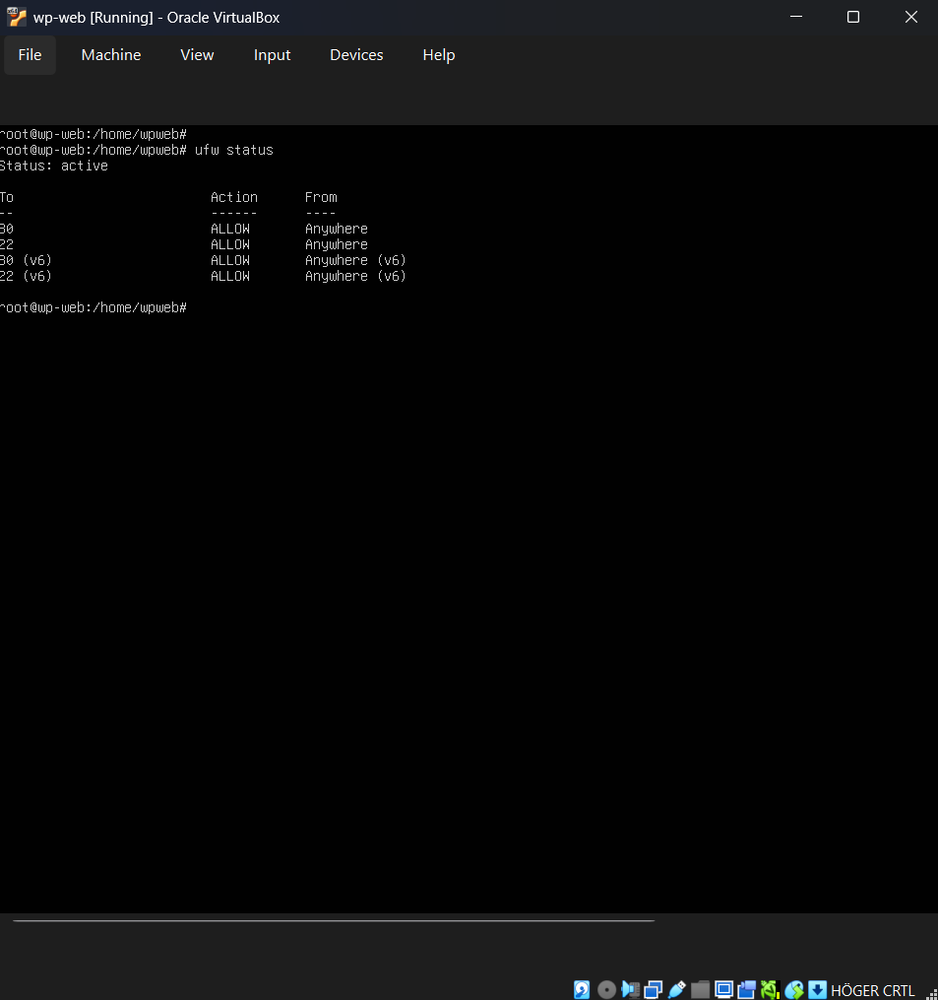
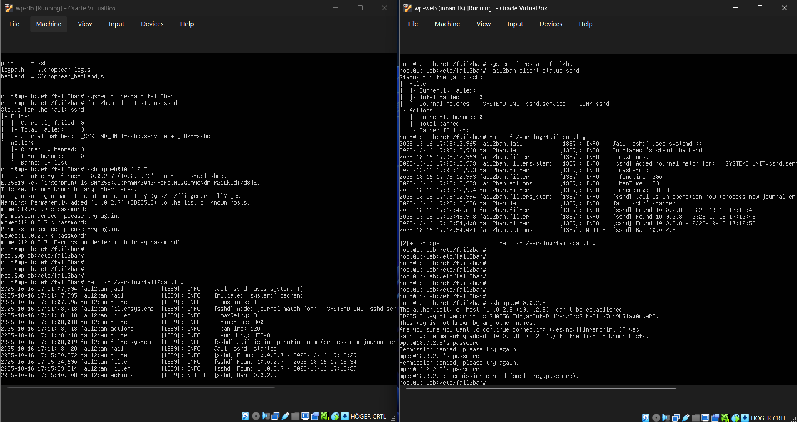
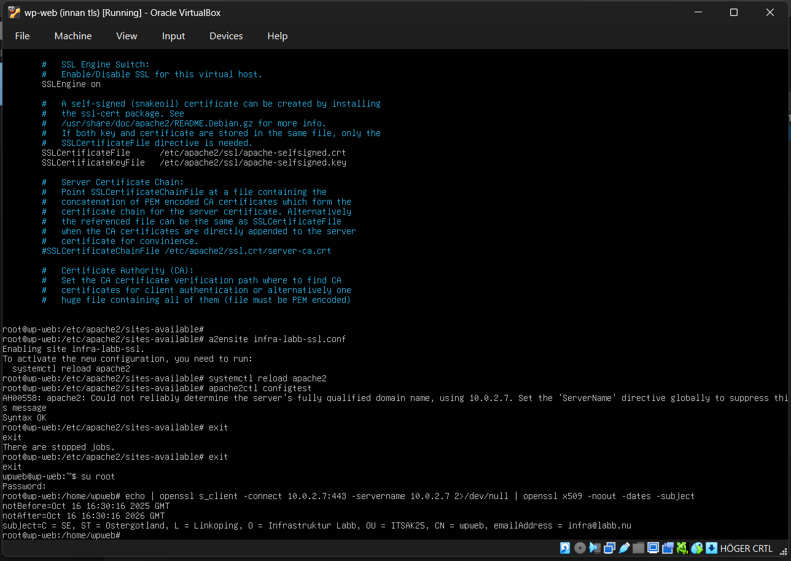

# Secure WordPress Infrastructure

## 🌄 Project Overview
This project shows how I set up a secure Linux infrastructure for WordPress. Instead of installing everything on a single server, I separated the Web Server and the Database Server to improve security and performance.

**Key Goals:**
* **Security:** Isolate the database so it cannot be reached directly from the internet.
* **Protection:** Block hackers with Firewalls and Fail2Ban.
* **Encryption:** Use SSL/TLS to encrypt traffic.

##  🔧 The Build
The setup consists of two separate Virtual Machines (VMs) on a private network:

* **VM 1: Web Server (`wp-web`)** - 10.0.2.7
    * Runs Apache and WordPress.
    * Open to the web (HTTP/HTTPS) but locked down with SSH keys.
* **VM 2: Database Server (`wp-db`)** - 10.0.2.8
    * Runs MariaDB.
    * **Isolated:** No internet access. It only accepts connections from the Web Server.

**Why split them up?**
By running the database on a separate server, I reduce the risk. If someone hacks the web server, they don't automatically get access to the database files. It also makes it easier to troubleshoot and upgrade each server individually.

## 🔒 Security Measures
Here are the tools and configs I used to harden the servers:

### 1. Firewall (UFW)
I configured **UFW** (Uncomplicated Firewall) on both servers to block all incoming traffic by default.
* **Web Server:** Only allows port 80, 443, and 22.
* **DB Server:** Only allows port 3306 from the specific IP of the Web Server.

*(Image: UFW Status showing strict rules)*

### 2. Stopping Brute-Force (Fail2Ban)
I installed **Fail2Ban** to stop people from guessing passwords. It monitors the logs and automatically bans any IP address that fails to login 3 times.

*(Image: Fail2Ban banning an IP after failed SSH attempts)*

### 3. Encryption (TLS/SSL)
I generated a **Self-Signed Certificate** for Apache. This ensures that all traffic between the user and the website is encrypted (HTTPS) instead of sending plain text.

*(Image: OpenSSL showing the active certificate)*

## 📚 Tech Stack
* **Virtualization:** Oracle VirtualBox
* **OS:** Ubuntu Server
* **Software:** Apache, MariaDB, WordPress
* **Security:** UFW, Fail2Ban, OpenSSL

---
*Created by [Me](https://github.com/JeNilSE)*
